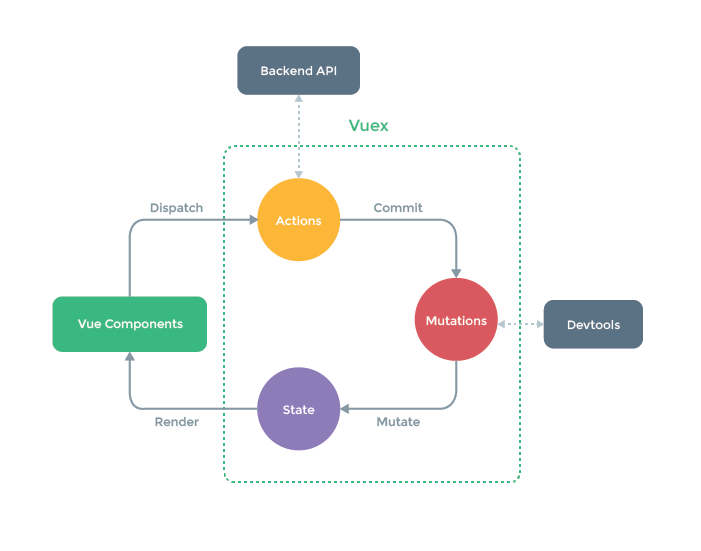

# Vue.js 学习报告
在`Vue.js`前端组件化思路下，一个朴素的开发流程如下图所示：

     

这和传统的网站开发没有太大的差异：我们将编写完的`HTML/JS/CSS`代码直接推送到服务器， 然后在浏览器中查看效果并进行一些手工测试。唯一的区别在于，在组件化思路下，我们将编写`HTML/JS/CSS`的工作，从网页级别分拆到`组件`级别了。

**组件化分拆引发的麻烦**

组件化分拆的理念很好，但是写起代码来相当地生硬。例如，为了组织`EzApp`组件的`HTML`模板、`CSS`样式和`JS`代码，我们不得不借助于宿主HTML文件：


这种代码组织方式存在着一些令人不吐不快的问题：

* 代码太杂乱：组件的相关代码，散落在各处，看起来不爽，维护起来麻烦
* 组件不独立：组件存在对宿主HTML文件和样式文件的依赖，不是自包含的
* 样式未隔离：组件样式是全局有效的，不同组件的样式声明可能冲突

为了解决组件化分拆后的问题，`Vue.js`定义了一种新的文件格式：`.vue`文件，来组织一个`Vue.js`组件的各种代码资源：


`.vue`文件的结构看起来很像`HTML`，直观，也容易理解。它使用不同的标签来声明组件不同类型的代码资源：

	<template>：在tempalte标签内编写组件的HTML模板
	<script> ：在script标签内编写组件的JS代码
	<style>：在style标签内编写组件的CSS样式

**组件的模块化**

你或许注意到，`.vue`文件的模板声明段和样式定义段，包含的内容都没有什么特别之处，只是在JS代码段，有一行特殊的代码：`module.exports = ...`。

`module.exports`是`CommonJS`规范中的模块输出声明语法，这意味着`.vue`文件的`JS`代码段， 被设计为一个`JavaScript`模块，其输出为组件配置对象。

## Vue.js 安装
* 1、独立版本   
  我们可以在 `Vue.js` 的官网上直接下载 `vue.min.js` 并用 `<script>` 标签引入。
* 2、使用 CDN 方法   
	* Boot CDN （国内）:[https://cdn.bootcss.com/vue/2.6.8/vue.min.js](https://cdn.bootcss.com/vue/2.6.8/vue.min.js)
	* Staticfile CDN（国内）: [https://cdn.staticfile.org/vue/2.2.2/vue.min.js](https://cdn.staticfile.org/vue/2.2.2/vue.min.js)
	* unpkg：[https://unpkg.com/vue/dist/vue.js](https://unpkg.com/vue/dist/vue.js), 会保持和 npm 发布的最新的版本一致。
	* cdnjs : [https://cdnjs.cloudflare.com/ajax/libs/vue/2.1.8/vue.min.js](https://cdnjs.cloudflare.com/ajax/libs/vue/2.1.8/vue.min.js)
* 3、NPM方法  
	* 安装npm:   
		在[Node.js](https://nodejs.org/en/download/)可以根据不同平台系统选择你需要的Node.js安装包。注意`npm`版本需要大于 3.0。	
	* 安装cnpm：   
		由于`npm`安装速度慢，使用了淘宝的镜像及其命令`cnpm`。
		在终端输入：   
		`sudo npm install -g cnpm --registry=https://registry.npm.taobao.org`    
		输入密码即可

	* 命令行工具
		`Vue.js`提供一个官方命令行工具，可用于快速搭建大型单页应用。
		* 全局安装`vue-cli`

			```
			$ sudo cnpm install --global vue-cli
			```
			出现下面信息表示安装成功   
			
		* 创建一个基于 webpack 模板的新项目
			
			```
			$ vue init webpack my-project
			```
			这里需要进行一些配置，默认回车即可
			

		* 进入项目，安装并运行：
			
			```
			$ cd my-project
			$ cnpm install
			$ cnpm run dev
			```
			运行正常就会出现如下信息：     
			   
		* 成功执行以上命令后访问`http://localhost:8080/`，输出结果如下所示：   
			
		
		***
		
		**现在`Vue-cli`已经出了3.0，所以若要升级到新版本，需要先写在旧版本，在命令行输入**
		
		```
		npm uninstall vue-cli -g
		//如果此命令没有删除掉旧版vue-cli，建议之前去/user/local/lib文件夹里删掉即可
		
		sudo npm install -g @vue/cli 
		//安装新版的vue-cli
		vue create my-project
		//创建项目
		```
		相关配置如下   
		

## 组件化思想
* 独立的，可复用，整体化
* 为什么组件化：实现功能的模块化，高效率执行，开发单页面复杂应用
* 组建间的状态管理（vuex)
* 多组件的混合使用，多页面，复杂业务（vue-router)
* 组建间的传参，消息，事件管理（props,emit/on,bus)

## 目录解析


使用`vue init webpack my-project`安装了项目`my-project`，此文件夹的目录解析：

|目录/文件|	说明|
|---|---|
|build|项目构建(webpack)相关代码|
|config|配置目录，包括端口号等|
|node_modules	|npm加载的项目依赖模块|
|src|这里是我们要开发的目录，基本上要做的事情都在这个目录里。里面包含了几个目录及文件：`assets`: 放置一些图片，如logo等。`components`: 目录里面放了一个组件文件，可以不用。`App.vue`: 项目入口文件，我们也可以直接将组件写这里，而不使用 components 目录。`main.js`: 项目的核心文件|
|static|静态资源目录，如图片、字体等|
|test|初始测试目录，可删除|
|.xxxx文件|这些是一些配置文件，包括语法配置，`git`配置等|
|index.html|首页入口文件，你可以添加一些`meta`信息或统计代码|
|package.json|项目配置文件|
|README.md|项目的说明文档，markdown 格式|

# Vue.js 起步
每个`Vue`应用都需要通过实例化`Vue`来实现。
语法格式如下：

```
var vm = new Vue({
	el: '#vue_det',
	data: {
		site: "Vue",
		url: "www.example.com",
		alexa: "10000"
	},
	methods: {
		details: function() {
			return  this.site + " 教程";
		}
	}
});
```

`Vue`构造器中有一个`el`参数，它是`DOM`元素中的`id`。在上面实例中`id`为 `vue_det`，在`div`元素中：    
`<div id = "vue_det"></div>`   
这意味着我们接下来的改动全部在以上指定的`div`内，`div`外部不受影响。

如何定义数据对象。

* `data`用于定义属性，实例中有三个属性分别为：site、url、alexa。
* `methods`用于定义的函数，可以通过`return`来返回函数值。
* `{{ }}`用于输出对象属性和函数返回值。

当一个`Vue`实例被创建时，它向`Vue`的响应式系统中加入了其`data`对象中能找到的所有的属性。当这些属性的值发生改变时，`html`视图将也会产生相应的变化。注意**设置属性也会影响到原始数据，反之亦然**

除了数据属性，`Vue`实例还提供了一些有用的实例属性与方法。它们都有前缀`$`，以便与用户定义的属性区分开来。

```
document.write(vm.$data === data) // true
document.write(vm.$el === document.getElementById('vue_det')) // true
```

## Vue.js 模板语法
`Vue.js`使用了基于`HTML`的模版语法，允许开发者声明式地将`DOM`绑定至底层`Vue`实例的数据。
`Vue.js`的核心是一个允许你采用简洁的模板语法来声明式的将数据渲染进`DOM`的系统。
结合响应系统，在应用状态改变时，`Vue`能够智能地计算出重新渲染组件的最小代价并应用到 `DOM`操作上。

### 插值
* 文本    
	数据绑定最常见的形式就是使用`{{...}}`（双大括号）的文本插值：
	
	```
	<div id="app">
		<p>{{ message }}</p>
	</div>
	```

* Html    
	使用`v-html`指令用于输出`html`代码：

	```
	<div id="app">
		<div v-html="message"></div>
	</div>
	<script>
	new Vue({
		el: '#app',
		data: {
			message: '<h1>教程</h1>'
		}
	});
	</script>
	```

* 属性    
	`HTML`属性中的值应使用`v-bind`指令。
	以下实例判断`class`的值，如果为`true`使用`class1`类的样式，否则不使用该类：

	```
	<div id="app">
		<label for="r1">修改颜色</label><input type="checkbox" v-model="class1" id="r1">
		<br><br>
		<div v-bind:class="{'class1': class1}">
			directiva v-bind:class
		</div>
	</div>

	<script>
	new Vue({
		el: '#app',
		data:{
			class1: false
		}
	});
	</script>
	```

* 表达式
	`Vue.js`都提供了完全的`JavaScript`表达式支持。
* 指令   
	指令是带有`v-`前缀的特殊属性。
	指令用于在表达式的值改变时，将某些行为应用到`DOM`上。如下例子：
	
	```
	<div id="app">
    	<p v-if="seen">现在你看到我了</p>
	</div>
    
	<script>
	new Vue({
		el: '#app',
		data: {
			seen: true
		}
	})
	</script>
	```
	这里，`v-if`指令将根据表达式 `seen`的值(`true`或`false`)来决定是否插入`p`元素。
* 参数    
	参数在指令后以冒号指明。例如，`v-bind`指令被用来响应地更新`HTML`属性：
	
	```
	<div id="app">
		<pre><a v-bind:href="url">教程</a></pre>
	</div>
	
	<script>
	new Vue({
		el: '#app',
		data: {
			url: 'http://www.example.com'
		}
	})
	</script>
	```

	在这里`href`是参数，告知`v-bind`指令将该元素的`href`属性与表达式`url`的值绑定。
	另一个例子是 v-on 指令，它用于监听 DOM 事件：   
	`<a v-on:click="doSomething">`    
	在这里参数是监听的事件名。

* 修饰符
	修饰符是以半角句号`.`指明的特殊后缀，用于指出一个指定应该以特殊方式绑定。例如,`.prevent` 修饰符告诉`v-on` 指令对于触发的事件调用`event.preventDefault()`：    
	`<form v-on:submit.prevent="onSubmit"></form>`     

* 用户输入
	在`input`输入框中我们可以使用`v-model`指令来实现双向数据绑定：
	
	```
	<div id="app">
		<p>{{ message }}</p>
		<input v-model="message">
	</div>
	
	<script>
	new Vue({
		el: '#app',
		data: {
			message: 'Hello!'
		}
	})
	</script>
	```
	按钮的事件我们可以使用`v-on`监听事件，并对用户的输入进行响应。    
	以下实例在用户点击按钮后对字符串进行反转操作：
	
	```
	<div id="app">
		<p>{{ message }}</p>
		<button v-on:click="reverseMessage">反转字符串</button>
	</div>
	
	<script>
	new Vue({
		el: '#app',
		data: {
			message: 'Hello!'
		},
		methods: {
			reverseMessage: function () {
				this.message = this.message.split('').reverse().join('')
			}
		}
	})
	</script>
	```
* 过滤器     
	`Vue.js` 允许自定义过滤器，被用作一些常见的文本格式化。由"管道符"指示, 格式如下：
	
	```
	<!-- 在两个大括号中 -->
	{{ message | capitalize }}

	<!-- 在 v-bind 指令中 -->
	<div v-bind:id="rawId | formatId"></div>
	```
	
	过滤器函数接受表达式的值作为第一个参数。     
	过滤器可以串联：    
	`{{ message | filterA | filterB }}`     
	过滤器是`JavaScript`函数，因此可以接受参数：    
	`{{ message | filterA('arg1', arg2) }}`    
	这里，`message`是第一个参数，字符串 `'arg1'` 将传给过滤器作为第二个参数， `arg2`表达式的值将被求值然后传给过滤器作为第三个参数。

* 缩写    
	`v-bind`缩写
	
	```
	<!-- 完整语法 -->
	<a v-bind:href="url"></a>
	<!-- 缩写 -->
	<a :href="url"></a>
	```
	`v-on` 缩写
	
	```
	<!-- 完整语法 -->
	<a v-on:click="doSomething"></a>
	<!-- 缩写 -->
	<a @click="doSomething"></a>
	```

## Vue.js 监听属性
* 监听属性: `watch`，通过 `watch` 来响应数据的变化。监听一个变量.

	```
	var vm = new Vue({
        el: '#app',
        data: {
            message: 'Runoob!'
        },
        watch: {
            message: function(newval,oldval) {
                console.log('newval is:'+newval);
                console.log('oldval is:' + oldval)
            }
        },
    })
    ```
    当在console里改变message的值的时候，console就会输出两行新值和旧值


## Vue.js 计算属性

* 计算属性关键词: `computed` (数据联动）
* 通常监听多个变量，但这个变量一定是在这个vue实例里面的，当它监听的变量发生变化时，它才会执行。
	
	```
	<div id="app">
   <p>原始字符串: {{ message }}</p>
   <p>计算后反转字符串: {{ reversedMessage }}</p>
    </div>
 
    <script>
    var vm = new Vue({
        el: '#app',
        data: {
            message: 'Runoob!'
        },
        computed: {
             // 计算属性的 getter
             reversedMessage: function () {
             // `this` 指向 vm 实例
             return this.message.split('').reverse().join('')
         }
      }
    })
    </script>
    ```
    声明了一个计算属性 `reversedMessage` 。
提供的函数将用作属性 `vm.reversedMessage` 的 `getter` 。
`vm.reversedMessage `依赖于 `vm.message`，在 `vm.message` 发生改变时，`vm.reversedMessage` 也会更新。注意它可以同时监听多个变量

* `computed` vs `methods`
我们可以使用 `methods` 来替代 `computed`，效果上两个都是一样的，但是 `computed` 是基于它的依赖缓存，只有相关依赖发生改变时才会重新取值。而使用 `methods` ，在重新渲染的时候，函数总会重新调用执行。
			
## Vue.js 条件与循环
* 条件选择
	* `v-if`
	* `v-else`
	* `v-else-if`

		```
		<div id="app">
			<div v-if="Math.random() > 0.5">
				Sorry
			</div>
			<div v-else-f="Math.random() < 0.5">
				Not sorry
			</div>
			<div v-else="Math.random() == 0.5">
				Nothing
			</div>
		</div>
    
		<script>
		new Vue({
			el: '#app'
		})
		</script>
		```
		
	* `v-show`:符合条件，就显示文本count的值

		```
		<div id="app">
			<div v-show="count== 1">
				{{count}}
			</div>
		</div>
    
		<script>
		new Vue({
			el: '#app',
			data: {
			    count = 1
			}
		})
		</script>
		```

* 循环语句`v-for` 指令。
`v-for` 指令需要以 `site in sites` 形式的特殊语法， `sites` 是源数据数组并且 `site` 是数组元素迭代的别名。`v-for` 可以绑定数据到数组来渲染一个列表：

	```
	<div id="app">
		<ul>
			<li v-for="(value, key, index) in object">
			{{ index }}. {{ key }} : {{ value }}
			</li>
		</ul>
	</div>
	
	<script>
	new Vue({
		el: '#app',
		data: {
			object: {
				name: '教程',
				url: 'http://www.baidu.com',
				slogan: 'Vue'
			}
		}
	})
	</script>
	```

## Vue.js 样式绑定
* class 属性绑定
我们可以为 `v-bind:class` 设置一个对象，从而动态的切换 `class`:
	* `<div v-bind:class="{ active: isActive }"></div>`   
		如果`isActive`的值是`true`，此`div`的`class`就是`active`
	* `<div class="static" v-bind:class="{ active: true, 'text-danger': true }">   </div>`     
		此`div`的`class`是 `static active text-danger`,如果这三个class选择器中有重复的属性，后面的会覆盖前面的
	* 数组语法    
		`<div v-bind:class="['active','text-danger']">  </div>`    
		这个div的class是`active text-danger`
		
## Vue.js style(内联样式)
我们可以在 `v-bind:style` 直接设置样式：

```
<div id="app">
    <div v-bind:style="{ color: activeColor, fontSize: fontSize + 'px' }">教程</div>
</div>
```
也可以直接绑定到一个样式对象，让模板更清晰：

```
<div id="app">
  <div v-bind:style="styleObject">教程</div>
</div>
```
## Vue-router
* `Vue-router`允许我们通过不同的 `URL` 访问不同的内容，可以实现多视图的单页Web应用
* 点击某个`router`就加载`router`对应的组建
* 组件
	* 创建一个`Info.vue`文件，作为组件
	* 在`router.js`文件中加入这个组件的`router`
	
		```
		import Info from './views/Info.vue';
		...
		routes: [
			...
			{
			    path: '/info',
			    name: 'info',
			    component: Info,
			 },
			 ...
	    ]
	    ```
	 * 在`App.vue`中添加`<router-link>` 组件，该组件用于设置一个导航链接，切换不同 HTML 内容。 to 属性为目标地址， 即要显示的内容。     
	 	`<router-link to="/info">Info</router-link>`
	 	
## Vuex介绍（状态管理模式）
* 多个视图依赖于同一状态（例如：菜单导航）
* 来自不同视图的行为需要变更同一状态（例如：弹幕）

### 1. 开始
每一个 Vuex 应用的核心就是 store（仓库）。“store”基本上就是一个容器，它包含着你的应用中大部分的状态 (state)。Vuex 和单纯的全局对象有以下两点不同：

Vuex 的状态存储是响应式的。当 Vue 组件从 store 中读取状态的时候，若 store 中的状态发生变化，那么相应的组件也会相应地得到高效更新。

你不能直接改变 store 中的状态。改变 store 中的状态的唯一途径就是显式地提交 (commit) mutation。这样使得我们可以方便地跟踪每一个状态的变化，从而让我们能够实现一些工具帮助我们更好地了解我们的应用。

  
  上图中绿色虚线包裹起来的部分就是`Vuex`的核心, `state`中保存的就是公共状态, 改变`state`的唯一方式就是通过`mutations`进行更改. 
  
### 二. 为什么要使用Vuex?
试想这样的场景, 比如一个Vue的根实例下面有一个根组件名为App.vue, 它下面有两个子组件A.vue和B.vue, App.vue想要与A.vue或者B.vue通讯可以通过props传值的方式, 但是如果A.vue和B.vue之间的通讯就很麻烦了, 他们需要共有的父组件通过自定义事件进行实现, A组件想要和B组件通讯往往是这样的:

* A组件说: "报告老大, 能否帮我托个信给小弟B" => dispatch一个事件给App
* App老大说: "包在我身上, 它需要监听A组件的dispatch的时间, 同时需要broadcast一个事件给B组件"
* B小弟说: "信息已收到", 它需要on监听App组件分发的事件

这只是一条通讯路径, 如果父组件下有多个子组件, 子组件之间通讯的路径就会变的很**繁琐**, 父组件需要监听大量的事件, 还需要负责分发给不同的子组件, 很显然这并不是我们想要的组件化的开发体验.Vuex就是为了解决这一问题出现的

### 三.如何引入Vuex?

* 下载vuex: `npm install vuex --save`
* 在`main.js`添加:（名字无所谓）
	
	```
	import Vuex from 'vuex'

	Vue.use( Vuex );

	const store = new Vuex.Store({
    	state:{ 
    		products: [
    			{name: '鼠标', price: 20},
             	{name: '键盘', price: 40},
             	{name: '耳机', price: 60},
             	{name: '显示屏', price: 80}
    		]
  		}
	})
	

	new Vue({
    	el: '#app',
    	store,
    	render: h => h(App)
	})
	```

* 核心概念1: `State`: `state`就是`Vuex`中的公共的状态, 我是将`state`看作是所有组件的`data`, 用于保存所有组件的公共数据.
	* 此时,`ProductListOne.vue`和`ProductListTwo.vue`也需要做相应的更改,将公共数据抽离出来

	```
	//ProductListOne.vue
	export default {
		data () {
			return {
            	products : this.$store.state.products //获取store中state的数据
        	}
    	}
	}

	//ProductListTwo.vue
	export default {
    	data () {
        	return {
            	products: this.$store.state.products //获取store中state的数据
        	}
    	}
	}
	```

* 核心概念2: `Getters`: 可以将`getter`理解为`store`的计算属性, `getters`的返回值会根据它的依赖被缓存起来，且只有当它的依赖值发生了改变才会被重新计算。此时,我们可以在`main.js`中添加一个`getters`属性, 其中的`saleProducts`对象将`state`中的价格减少一半(除以2)

	```
	const store = new Vuex.Store({
		state:{
    		products: [
    			{name: '鼠标', price: 20},
    			{name: '键盘', price: 40},
    			{name: '耳机', price: 60},
    			{name: '显示屏', price: 80}
    			]
    		},
    	getters:{ //添加getters
    		saleProducts: (state) => {
  				let saleProducts = state.products.map( product => {
  					return {
  						name: product.name,
  						price: product.price / 2
  					}
  				})
  				return saleProducts;
  			}
  		} 
  	})
  	```
  	
	* 将`productListOne.vue`中的`products`的值更换为`this.$store.getters.saleProducts`
  
	```
	export default {
		data () {
			return {
				products : this.$store.getters.saleProducts 
			}
		}
	}
	```
	
	* 现在的页面中,`Product List One`中的每项商品的价格都减少了一半

### 核心概念3: Mutations

* 我将`mutaions`理解为`store`中的`methods`, `mutations`对象中保存着更改数据的回调函数,该函数名官方规定叫`type`, 第一个参数是`state`, 第二参数是自定义的参数.
	* 我们在`main.js`中添加`mutations`属性 

	```
	mutations:{ //添加mutations
		minusPrice (state, payload ) {
			let newPrice = state.products.forEach( product => {
				product.price -= payload
			})
		}
	}
	```
	
	* 在`ProductListTwo.vue`中添加一个按钮,为其添加一个点击事件, 给点击事件触发`minusPrice`方法
	* 在`ProductListTwo.vue`中注册`minusPrice`方法, 在该方法中`commitmutations`中的`minusPrice`这个回调函数     
	**注意:调用`mutaions`中回调函数, 只能使用`store.commit(type, payload)`**
	 
	 ```
	 //ProductListTwo.vue
	 export default {
	 	data () {
	 		return {
	 			products: this.$store.state.products
	 		}
	 	},
	 	methods: {
	 		minusPrice() {
	 			this.$store.commit('minusPrice', 2); //提交minusPrice,payload为2
	 		}
	 	}
	 }
	 ```

### 核心概念4: Actions
`actions` 类似于 `mutations`，不同在于：

* `actions`提交的是`mutations`而不是直接变更状态
* `actions`中可以包含异步操作, `mutations`中绝对不允许出现异步
* `actions`中的回调函数的第一个参数是`context`, 是一个与`store`实例具有相同属性和方法的对象

	* 我们在`store`中添加`actions`属性, 其中minusPriceAsync采用setTimeout来模拟异步操作,延迟2s执行 该方法用于异步改变我们刚才在mutaions中定义的minusPrice

	```
	actions:{ //添加actions
		minusPriceAsync( context, payload ) {
			setTimeout( () => {
				context.commit( 'minusPrice', payload ); //context提交
			}, 2000)
		}
	}
  ```
  * 在`ProductListTwo.vue`中注册`minusPriceAsync`方法, 在该方法中`dispatch` `actions`中的`minusPriceAsync`这个回调函数

  	```
  	minusPriceAsync() {
  		this.$store.dispatch('minusPriceAsync', 5); //分发actions中的minusPriceAsync这个异步函数
  	}
  	```
  
### 核心概念5: Modules

由于使用单一状态树，应用的所有状态会集中到一个比较大的对象。当应用变得非常复杂时，store 对象就有可能变得相当臃肿。为了解决以上问题，Vuex 允许我们将 store 分割成模块（module）。每个模块拥有自己的 state、mutation、action、getter、甚至是嵌套子模块——从上至下进行同样方式的分割


	