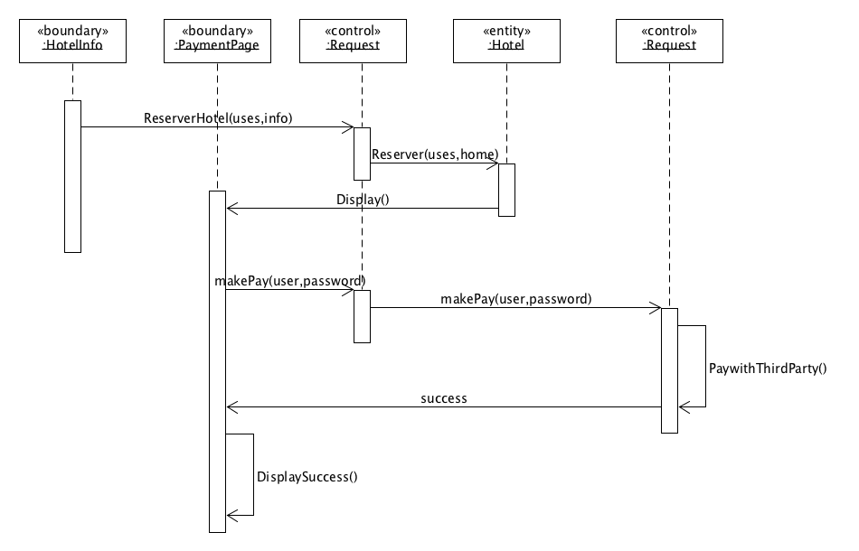
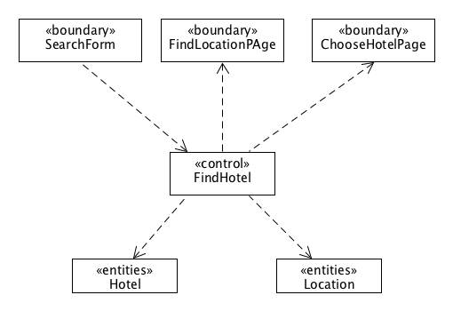
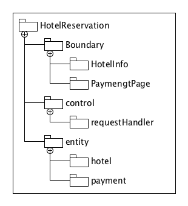

# Lesson16

- 使用 ECB 实现 make reservation 用例的详细设计（包含用例简介，顺序图，类图）

    - 用例介绍
        1. 用户登录系统
        2. 用户根据酒店名搜索酒店
        3. 用户根据地址搜索酒店
        4. 用户支付订单
    -  顺序图
    
    	
    -  类图
    
    	
- 将逻辑设计类图映射到实际项目框架的包图。用树形结构表述实现的包和类
	
	