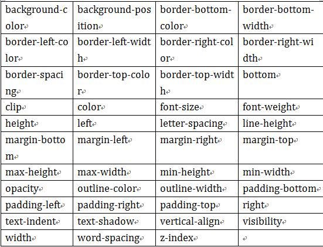

# CSS3学习
## 1. 边框
* 1.1 圆角效果 border-radius
	* `border-radius:10px; /* 所有角都使用半径为10px的圆角 */ `   
	* `border-radius: 5px 4px 3px 2px; `
	  `/* 四个半径值分别是左上角、右上角、右下角和左下角，顺时针 */ `
* 1.2 阴影 box-shadow   

	> box-shadow: X轴偏移量 Y轴偏移量 [阴影模糊半径] [阴影扩展半径] [阴影颜色] [投影方式];
	
	
	
	* 示例
	
		```
		.boxshadow-outset{
			width:100px;
			height:100px;
			box-shadow:10px 4px 6px #666;
		}
		```
		效果  
		   
		
		* 添加多个阴影，只需用逗号隔开即可
		
		```
		.boxshadow-multi{
		 	width:100px;
		 	height:100px;
			box-shadow:4px 2px 6px #f00, -4px -2px 6px #000, 0px 0px 12px 5px #33CC00 inset;
		}
		```
		效果   
		
* 1.3 为边框应用图片 border-image

	

## 2. 颜色相关
* 2.1 颜色之RGBA
	* 语法： `color：rgba(R,G,B,A)`    
	R、G、B三个参数，正整数值的取值范围为：0 - 255；百分数值的取值范围为：`0.0% - 100.0%`。超出范围的数值将被截至其最接近的取值极限。并非所有浏览器都支持使用百分数值。A为透明度参数，取值在0~1之间，不可为负值。 

* 2.2 色彩 
	* 线性渐变：   
		
		* 第一个参数:指定渐变方向，可以用“角度”的关键词或“英文”来表示，省略时，默认为“180deg”，等同于“to bottom”。
		
		* 第二个和第三个参数，表示颜色的起始点和结束点，可以有多个颜色值。

## 3.CSS3文字与字体
* 3.1 `text-overflow`     

但是`text-overflow`只是用来说明文字溢出时用什么方式显示，要实现溢出时产生省略号的效果，还须定义强制文本在一行内显示及溢出内容为隐藏，只有这样才能实现溢出文本显示省略号的效果

	```
	text-overflow:ellipsis; 
	overflow:hidden; //溢出内容为隐藏
	white-space:nowrap;//在一行内显示
	```
* 3.2 `word-wrap`也可以用来设置文本行为，当前行超过指定容器的边界时是否断开转行
  
* 3.3 嵌入字体`@font-face`
	* 语法：
	
	```
	@font-face {
		font-family : 字体名称;
		src : 字体文件在服务器上的相对或绝对路径;
	}
	```
* 3.4 文本阴影text-shadow  
    
	`text-shadow: X-Offset Y-Offset blur color;`
	* X-Offset：表示阴影的水平偏移距离，其值为正值时阴影向右偏移，反之向左偏移；      
	* Y-Offset：是指阴影的垂直偏移距离，如果其值是正值时，阴影向下偏移，反之向上偏移；
	* Blur：是指阴影的模糊程度，其值不能是负值，如果值越大，阴影越模糊，反之阴影越清晰，如果不需要阴影模糊可以将Blur值设置为0；(单位px）
	* Color：是指阴影的颜色，其可以使用rgba色。

## 4. 与背景相关的样式
* 4.1 background-origin： 设置元素背景图片的原始起始位置。

	`background-origin ： border-box | padding-box | content-box;`   
	参数分别表示背景图片是从边框，还是内边距（默认值），或者是内容区域开始显示。     
	
	  
	**需要注意的是，如果背景不是no-repeat，这个属性无效，它会从边框开始显示。**

*  4.2 `background-clip`：用来将背景图片做适当的裁剪以适应实际需要。

	`background-clip ： border-box | padding-box | content-box | no-clip`    
	参数分别表示从边框（默认值）、或内填充，或者内容区域向外裁剪背景。`no-clip`表示不裁切，和参数`border-box`显示同样的效果。
	   
	   

* 4.3 `background-size`：设置背景图片的大小，以长度值或百分比显示，还可以通过cover和contain来对图片进行伸缩。

	`background-size: auto | <长度值> | <百分比> | cover | contain`

	* auto：默认值，不改变背景图片的原始高度和宽度；
	* <长度值>：成对出现如200px 50px，将背景图片宽高依次设置为前面两个值，当设置一个值时，将其作为图片宽度值来等比缩放；
	* <百分比>：0％~100％之间的任何值，将背景图片宽高依次设置为所在元素宽高乘以前面百分比得出的数值，当设置一个值时同上；
	* `cover`：覆盖，即将背景图片等比缩放以**填满整个容器**；
	* `contain`：容纳，即将背景图片等比缩放至**某一边紧贴容器边缘为止**。

* 4.4 `multiple backgrounds`：多重背景，缩写时为用逗号隔开的每组值；用分解写法时，如果有多个背景图片，而其他属性只有一个（例如`background-repeat`只有一个），表明所有背景图片应用该属性值。

	```
	background-image:url1,url2,...,urlN;
	background-repeat : repeat1,repeat2,...,repeatN;
	backround-position : position1,position2,...,positionN;
	background-size : size1,size2,...,sizeN;
	background-attachment : attachment1,attachment2,...,attachmentN;
	background-clip : clip1,clip2,...,clipN;
	background-origin : origin1,origin2,...,originN;
	background-color : color;
	```

	* 用逗号隔开每组 background 的缩写值；
	* 如果有 size 值，需要紧跟 position 并且用` "/" `隔开；
如果有多个背景图片，而其他属性只有一个（例如 `background-repeat` 只有一个），表明所有背景图片应用该属性值。
	* `background-color` 只能设置一个。

## 5.CSS3 选择器
* 5.1 属性选择器：CSS3在CSS2的基础上对属性选择器进行了扩展，新增了3个属性选择器，使得属性选择器有了**通配符**的概念

	
* 5.2 结构性伪类选择器: 
	* `:not`选择器称为否定选择器，和jQuery中的`:not`选择器一模一样，可以选择除某个元素之外的所有元素。就拿form元素来说，比如说你想给表单中除submit按钮之外的input元素添加红色边框，CSS代码可以写成：

		```
		form {
			width: 200px;
			margin: 20px auto;
		}
		div {
			margin-bottom: 20px;
		}
		input:not([type="submit"]){
			border:1px solid red;
		}
		```
	* `:empty`选择器表示的就是空。用来选择没有任何内容的元素，这里没有内容指的是一点内容都没有，哪怕是一个空格。例如你想把没有任何内容的P元素隐藏起来。我们就可以用`:empty`选择器来控制。

		```
		p:empty{
		    dispaly = "none";
		}
		```
	* `:target`选择器称为目标选择器，用来匹配文档(页面)的`url`的某个标志符的目标元素。

		例： 点击链接显示隐藏的段落。
		
		* HTML代码：
	
			```
			<h2><a href="#brand">Brand</a></h2>
			<div class="menuSection" id="brand">content for Brand</div>
			```
		* CSS代码：
		
			```
			.menuSection{
				display: none;
			}
			#brand:target{/*这里的:target就是指id="brand"的div对象*/
				display:block;
			}
			```
		* `:first-child`选择器表示的是选择父元素的第一个子元素的元素E。简单点理解就是选择元素中的第一个子元素，记住是子元素，而不是后代元素。
		* `:last-child`选择器与`:first-child`选择器作用类似，不同的是`:last-child`选择器选择的是元素的最后一个子元素。
		* `:nth-child(n)`选择器用来定位某个父元素的一个或多个特定的子元素。其中“n”是其参数，而且可以是整数值(1,2,3,4)，也可以是表达式(2n+1、-n+5)和关键词(odd、even)，但参数n的**起始值始终是1**，而不是0。也就是说，参数n的值为0时，选择器将选择不到任何匹配的元素。当`:nth-child(n)`选择器中的n为一个表达式时，其中n是从0开始计算，当表达式的值为0或小于0的时候，不选择任何匹配的元素。
		* `:nth-last-child(n)`选择器是从某父元素的最后一个子元素开始计算，来选择特定的元素.
		* `:first-of-type`选择器类似于`:first-child`选择器，不同之处就是指定了元素的类型,其主要用来定位一个父元素下的某个类型的第一个子元素。

			```
			.wrapper p:first-of-type {
				...//wrapper容器下第一个类型为p的元素
			}
			```
		* `:nth-of-type(n)`选择器和`:nth-child(n)`选择器非常类似，不同的是它只计算父元素中指定的某种类型的子元素。当某个元素中的子元素不单单是同一种类型的子元素时，使用`:nth-of-type(n)`选择器来定位于父元素中某种类型的子元素是非常方便和有用的。在`:nth-of-type(n)`选择器中的`n`和`:nth-child(n)`选择器中的`n`参数也一样，可以是具体的整数，也可以是表达式，还可以是关键词。
		* `:last-of-type`选择器和`:first-of-type`选择器功能是一样的，不同的是他选择是父元素下的某个类型的最后一个子元素。
		* `:nth-last-of-type(n)`选择器和`:nth-of-type(n)`选择器是一样的，选择父元素中指定的某种子元素类型，但它的起始方向是从最后一个子元素开始，而且它的使用方法类似于上节中介绍的`:nth-last-child(n)`选择器一样。
		* `:only-child`选择器选择的是父元素中只有一个子元素，而且只有唯一的一个子元素。也就是说，匹配的元素的父元素中仅有一个子元素，而且是一个唯一的子元素。
		* `:only-of-type`选择器用来选择一个元素是它的父元素的唯一一个相同类型的子元素。换一种说法`:only-of-type`是表示一个元素他有很多个子元素，而其中只有一种类型的子元素是唯一的，使用`:only-of-type`选择器就可以选中这个元素中的唯一一个类型子元素。
	* 其他伪类选择器(这些选择器都是针对CSS样式的，要实现其功能，是要在对应的元素标签里面加属性）
		* `:enabled`选择器: 在Web的表单中，有些表单元素有可用（`:enabled`）和不可用（`:disabled`）状态，比如输入框，密码框，复选框等。在默认情况之下，这些表单元素都处在可用状态。那么我们可以通过伪选择器`:enabled`对这些表单元素设置样式。
		* `:disabled`选择器用来选择不可用表单元素。要正常使用`:disabled`选择器，需要在表单元素的HTML中设置`disabled`属性。

			```
			/*Html*/
			<input type="text" name="name" id="name" placeholder="我是不可用输入框" disabled />
			/*CSS/
			input[type="text"]:disabled {
				background: rgba(0,0,0,.15);
				border: 1px solid rgba(0,0,0,.15);
				color: rgba(0,0,0,.15);
}
			```
		* `:checked`选择器: 在表单元素中，单选按钮和复选按钮都具有选中和未选中状态。（大家都知道，要覆写这两个按钮默认样式比较困难）。在CSS3中，我们可以通过状态选择器`:checked`配合其他标签实现自定义样式。而`:checked`表示的是选中状态。

		* `:read-only`伪类选择器用来指定处于只读状态元素的样式。给元素put设置`readonly=’readonly’`，那么这个文本框就不允许键入了，用此伪类可以修改这个文本框的样式。
		* `:read-write`选择器刚好与`:read-only`选择器相反，主要用来指定当元素处于非只读状态时的样式。
		* `:hover`在鼠标移到元素上时添加的特殊样式。`:link` 选择器设置了未访问过的页面链接样式, `:visited` 选择器设置访问过的页面链接的样式 `:active`选择器设置当你点击链接时的样式。注意: 为了产生预期的效果，在 CSS 定义中，`:hover` 必须位于 `:link` 和 `:visited` 之后！！
	* 伪元素选择器
		* `::selection`选择器: 用来选择突出显示的文本(用鼠标选择文本时的文本)。浏览器默认情况下，用鼠标选择网页文本是以“深蓝的背景，白色的字体”显示的，可以用它修改，Firefox 支持替代的 `::-moz-selection`。
		* `::before`和`::after`: 主要用来给元素的前面或后面插入内容，这两个常和`content`配合使用，使用的场景最多的就是清除浮动。

## 6.CSS3 变形
* 旋转`rotate()`: 通过指定的角度参数使元素相对原点进行旋转。它主要在二维空间内进行操作，设置一个角度值，用来指定旋转的幅度。如果这个值为正值，元素相对原点中心顺时针旋转；如果这个值为负值，元素相对原点中心逆时针旋转。

* 扭曲`skew()`: 能够让元素倾斜显示。它可以将一个对象以其中心位置围绕着X轴和Y轴按照一定的角度倾斜。这与`rotate()`函数的旋转不同，`rotate()`函数只是旋转，而不会改变元素的形状。`skew()`函数不会旋转，而只会改变元素的形状。
	* `Skew()`具有三种情况：
		* 1、`skew(x,y)`使元素在水平和垂直方向同时扭曲（X轴和Y轴同时按一定的角度值进行扭曲变形）；第一个参数对应X轴，第二个参数对应Y轴。如果第二个参数未提供，则值为0，也就是Y轴方向上无斜切。
			
		* 2、`skewX(x)`仅使元素在水平方向扭曲变形（X轴扭曲变形）；
		* 3、`skewY(y)`仅使元素在垂直方向扭曲变形（Y轴扭曲变形）

* 缩放`scale()`: 让元素根据中心原点对对象进行缩放。值默认的值为1，当值设置为0.01到0.99之间的任何值，作用使一个元素缩小；而任何大于或等于1.01的值，作用是让元素放大。
	* 缩放 `scale()` 具有三种情况：
		* 1、 `scale(X,Y)`使元素水平方向和垂直方向同时缩放（也就是X轴和Y轴同时缩放）Y是一个可选参数，如果没有设置Y值，则表示X，Y两个方向的缩放倍数是一样的。
		* 2、`scaleX(x)`元素仅水平方向缩放（X轴缩放）
		* 3、`scaleY(y)`元素仅垂直方向缩放（Y轴缩放）


* 位移`translate()`: 将元素向指定的方向移动，类似于`position`中的`relative`。使用translate()函数，可以把元素从原来的位置移动，而**不影响在X、Y轴上的任何Web组件**。
	* `translate()`我们分为三种情况：
		* 1、`translate(x,y)`水平方向和垂直方向同时移动（也就是X轴和Y轴同时移动）
		* 2、`translateX(x)`仅水平方向移动（X轴移动）
		* 3、`translateY(Y)`仅垂直方向移动（Y轴移动）


* 矩阵`matrix()` 是一个含六个值的(a,b,c,d,e,f)变换矩阵，用来指定一个2D变换，相当于直接应用一个[a b c d e f]变换矩阵。就是基于水平方向（X轴）和垂直方向（Y轴）重新定位元素.

* 原点`transform-origin`: 任何一个元素都有一个中心点，默认情况之下，其中心点是居于元素X轴和Y轴的50%处。CSS变形进行的旋转、位移、缩放，扭曲等操作都是以元素自己原点位置进行变形。可以通过`transform-origin`来对元素进行原点位置改变，使元素原点不在元素的中心位置，以达到需要的原点位置。`transform-origin`取值和元素设置背景中的`background-position`取值类似，如下表所示：
	


## 7.CSS3 动画
* 动画`transition`: 通过鼠标的单击、获得焦点，被点击或对元素任何改变中触发，并平滑地以动画效果改变CSS的属性值。
	* 在CSS中创建简单的过渡效果可以从以下几个步骤来实现：
		* 第一，在默认样式中声明元素的初始状态样式；
		* 第二，声明过渡元素**最终状态样式**，比如悬浮状态；
		* 第三，在默认样式中通过添加过渡函数，添加一些不同的样式。
	* 属性是一个复合属性，主要包括以下几个子属性：
		* 1.`transition-property`: 用来指定**过渡动画**的CSS属性名称，例如：`transtition-property: width;`表示对`width`进行过渡动画。具有过渡的CSS属性主要有：
			
			当`transition-property`属性设置为all时，表示的是所有变化值的属性。
		* 2.`transition-duration`:指定完成过渡所需的时间
		* 3.`transition-timing-function`:指定过渡函数, 主要用来指定浏览器的过渡速度，以及过渡期间的操作进展情况，其中要包括以下几种函数：

			
		* 4.`transition-delay`:指定开始出现的延迟时间
	* 有时我们想改变两个或者多个css属性的`transition`效果时，只要把几个`transition`的声明串在一起，用逗号隔开，然后各自可以有各自不同的延续时间和其时间的速率变换方式。但需要值得注意的一点：第一个时间的值为 transition-duration，第二个为transition-delay。例如：    
		`a{ transition: background 0.8s ease-in 0.3, color 0.6s ease-out 0.3;}`

## 8. CSS3 Keyframes介绍
* Keyframes被称为关键帧，其类似于Flash中的关键帧。在CSS3中其主要以“@keyframes”开头，后面紧跟着是动画名称加上一对花括号“{…}”，括号中就是一些不同时间段样式规则。这只是创建了一段动画，之后要调用动画
	
	```
	@keyframes changecolor{
		0%{
			background: red;
		}
		10%{
			background: blue;
		}
		....
		100%{
			background: green;
		}
	}
	```

	* 浏览器的支持情况：
		* Chrome 和 Safari 需要前缀 `-webkit-`；
		* Foxfire 需要前缀 `-moz-`。

* CSS3中调用动画
	* `animation-name`属性主要是用来调用 `@keyframes` 定义好的动画。需要特别注意: `animation-name` 调用的动画名需要和`@keyframes`定义的动画名称完全一致（区分大小写），如果不一致将不具有任何动画效果。
		* 语法：`animation-name: none | IDENT`;
			* 1、`IDENT`是由 @keyframes 创建的动画名；
			* 2、`none`为默认值，当值为 `none` 时，将没有任何动画效果,这可以用于覆盖任何动画。
	* `animation-duration`主要用来设置CSS3动画播放时间，单位：秒
	* `animation-timing-function`属性主要用来设置动画播放方式。主要让元素根据时间的推进来改变属性值的变换速率，简单点说就是动画的播放方式。(这是应用在每一段动画上的）

	* `animation-delay`属性用来定义动画开始播放的时间，用来触发动画播放的时间点。

	* `animation-iteration-count`属性主要用来定义动画的播放次数。
		* 语法规则：`animation-iteration-count: infinite | <number> `
			* 1、其值通常为整数，但也可以使用带有小数的数字，其默认值为1，这意味着动画将从开始到结束只播放一次。
			* 2、如果取值为`infinite`，动画将会无限次的播放。
	
	* `animation-direction`属性主要用来设置动画播放方向
		* 语法规则如下：`animation-direction:normal | alternate `
			* 1、`normal`是默认值，如果设置为`normal`时，动画的每次循环都是向前播放；
			* 2、另一个值是`alternate`，他的作用是，动画播放在第偶数次向前播放，第奇数次向反方向播放。

	* `animation-play-state`属性主要用来控制元素动画的播放状态。
		* 参数：running和paused。
		* `running`是其默认值，主要作用就是类似于音乐播放器一样，可以通过`paused`将正在播放的动画停下来，也可以通过`running`将暂停的动画重新播放，这里的重新播放不一定是从元素动画的开始播放，而是从暂停的那个位置开始播放。另外如果暂停了动画的播放，元素的样式将回到最原始设置状态。

	* `animation-fill-mode`属性定义在动画开始之前和结束之后发生的操作。主要具有四个属性值：none、forwards、backwords和both。其四个属性值对应效果如下：
		* `none`: 默认值，表示动画将按预期进行和结束，在动画完成其最后一帧时，动画会反转到初始帧处
		* `forwards`: 表示动画在结束后继续应用最后的关键帧的位置
		* `backwards`: 会在向元素应用动画样式时迅速应用动画的初始帧
		* `both`: 元素动画同时具有`forwards`和`backwards`效果

在默认情况之下，动画不会影响它的关键帧之外的属性，使用animation-fill-mode属性可以修改动画的默认行为。简单的说就是告诉动画在第一关键帧上等待动画开始，或者在动画结束时停在最后一个关键帧上而不回到动画的第一帧上。或者同时具有这两个效果。

## 9. CSS3 布局样式相关
* 多列布局：为了能在Web页面中方便实现类似报纸、杂志那种多列排版的布局，W3C特意给CSS3增加了一个多列布局模块，它主要应用在文本的多列布局方面。
	* `column`属性
		* 语法：`columns：<column-width> || <column-count>`
			* `<column-width>`: 主要用来定义多列中每列的宽度
			* `<column-count>`:主要用来定义多列中的列数 
		* 也可以单独设置列宽列数。
	* 列间距`column-gap`
	* 列表边框`column-rule`主要是用来定义列与列之间的边框宽度、边框样式和边框颜色。`column-rule`不占用任何空间位置的，在列与列之间改变其宽度不会改变任何列的位置。
		* `column-rule:<column-rule-width>|<column-rule-style>|<column-rule-color> `

	* 跨列设置`column-span`: 主要用来定义一个分列元素中的子元素能跨列多少。`column-width`、`column-count`等属性能让一元素分成多列，不管里面元素如何排放顺序，他们都是从左向右的放置内容，但有时我们需要基中一段内容或一个标题不进行分列，也就是横跨所有列，此时`column-span`就可以轻松实现，此属性的语法如下。
		`column-span: none | all`


## 10. CSS3 盒子模型
* CSS中每一个元素都是一个盒模型，包括html和body标签元素。在盒模型中主要包括`width、height、border、background、padding、margin`这些属性，而且他们之间的层次关系可以相互影响，来看一张盒模型的3D展示图：

	

* 在CSS3中新增加了`box-sizing`属性，能够事先定义盒模型的尺寸解析方式，其语法规则如下：`box-sizing: content-box | border-box | inherit`
	* `ontent-box` 默认值，其让元素维持W3C的标准盒模型，也就是说样式中的width和height指的是内容的高度和宽度。
	* `border-box`: 让元素维持IE传统的盒模型（IE6以下版本和IE6-7怪异模式），样式中的width和height指的是内容的高度和宽度加上内边距（padding)的宽度加上边框的宽度。
	* `inherit`: 使元素继承父元素的盒模型模式

## 11.CSS3 伸缩布局
* CSS3引入了一种新的布局模式——Flexbox布局，即伸缩布局盒模型，用来提供一个更加有效的方式制定、调整和分布一个容器里项目布局，即使它们的大小是未知或者动态的，这里简称为Flex。
	* 1.创建一个`flex`容器。任何一个`flexbox`布局的第一步是需要创建一个`flex`容器。为此给元素设置display属性的值为flex。在Safari浏览器中，你依然需要添加前缀`-webkit`，
		
		```
		.flexcontainer{
		display: -webkit-flex;
		display: flex; 
		}
		```

	* 2.Flex项目显示: Flex项目是Flex容器的子元素。他们沿着主要轴和横轴定位。默认的是沿着水平轴排列一行。你可以通过`flex-direction`来改变主轴方向修改为`column`，其默认值是`row`。

		```
		.flexcontainer{
			display: -webkit-flex; 
			display: flex; 
			-webkit-flex-direction: column; 
			flex-direction: column; 
		}
		```
	
	* 3.Flex项目移动到顶部: 取决于主轴的方向。`justify-content` 属性定义了项目在主轴上的对齐方式。`align-items` 属性定义项目在交叉轴上如何对齐。 如果主轴是水平的方向，通过`align-items`设置；如果主轴是垂直的方向，通过`justify-content`设置。
		
		```
		.flexcontainer{
			-webkit-flex-direction: column;
			flex-direction: column;
			-webkit-justify-content:flex-start; 
			justify-content:flex-start; 
		}

		.flexcontainer{
			display: -webkit-flex;
			display: flex; 
			-webkit-flex-direction: row; 
			flex-direction: row; 
			-webkit-align-items: flex-start; 
			align-items: flex-start; 
		}
		```
	* 4.Flex项目移到左边: flex项目称动到左边或右边也取决于主轴的方向。如果flex-direction设置为row，设置justify-content控制方向；如果设置为column，设置align-items控制方向。

		```
		.flexcontainer{ 
			display: -webkit-flex; 
			display: flex; 
			-webkit-flex-direction: row; 
			flex-direction: row;
			 -webkit-justify-content: flex-start; 
			 justify-content: flex-start; 
		}
		```


