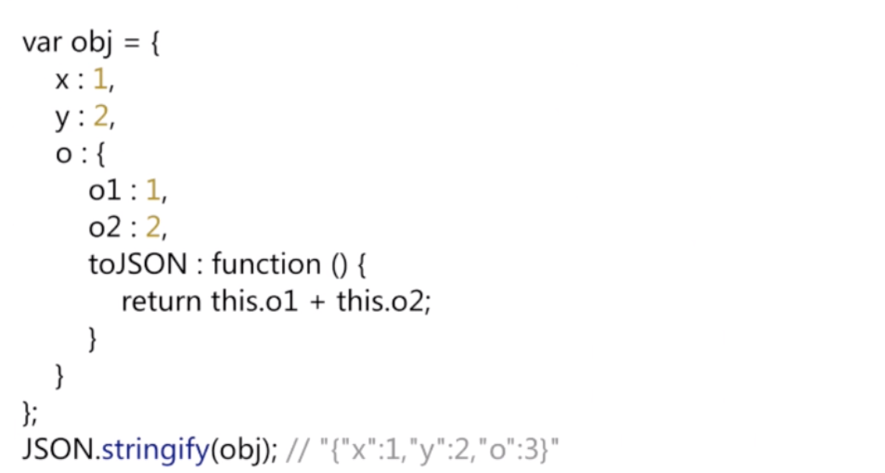
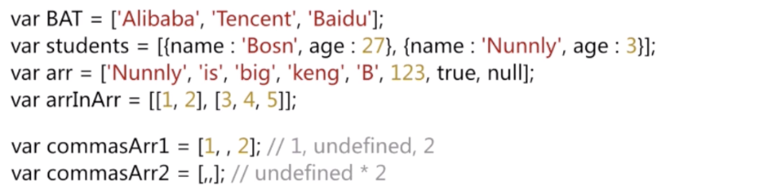
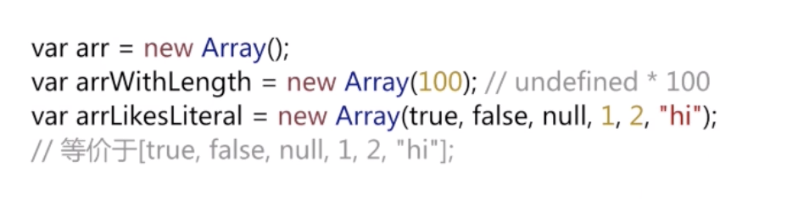
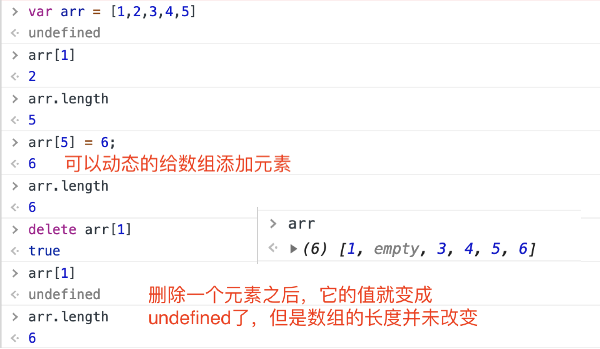
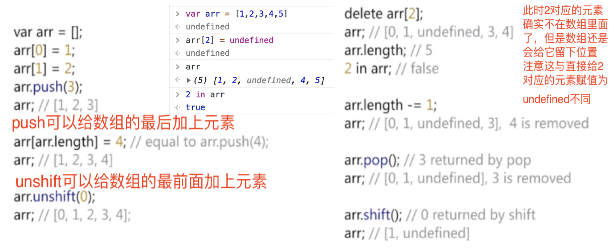
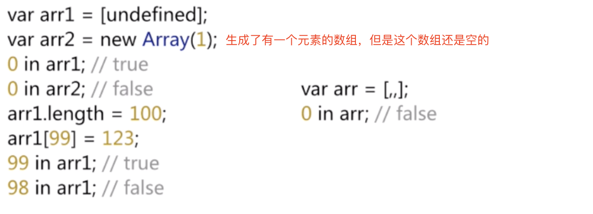

# JavaScript深入浅出
## 1.数据类型
### 1. JS六种数据类型

* 1.1 Object
	* Function
	* Array
	* Date
	* ...
* 1.2 原始类型
	* number
	* string
	* boolean
	* null
	* undefined

### 2. 隐式转换
* `+`和`-`
	* `+`：一个string类型加上一个number类型，`+`看作是字符串的拼接
	* `-`:一个string类型减去一个number类型，`-`看作是数字运算

### 3. 包装类型
* 3.1 `var str = "string";`   
这是变量的类型就是基本类型`string`
* 3.2 `var strObj = new String("string");`   
这个变量的类型是`string`类型对应的**包装类型**

Js 中基本类型`number`,`string`,`boolean`都有对应的包装类型。当把上述一个基本类型的变量尝试以对象的形式操作时，JS会创建一个临时的包装类型，它的值和这个基本类型是一样的，但是当操作结束后，这个临时变量就被销毁了。

### 4. 类型检测
* 4.1`typeof`   
	返回一个字符串，注意
	`typeof null === "object"`
	而且在判断数组的时候就不好用这个，因为其返回的是对象
* 4.2`instanceof `  
	用法`obj instanceof Object`，obj指对象，而Object指函数对象（函数构造器），判断左操作数对象的原型链上是不是有右操作数的prototype。注意不同的window或iframe之间的对象类型检测不能用它
* 4.3 `Object.prototype.toString.apply()`  
	例如： `Object.prototype.toString.apply([]) === "[object Array]"`

## 2. 表达式和运算符
> 表达式：JS短语，可以使JS解释器用来产生一个值 --- 《JS权威指南》

### 2.1 表达式
* 原始表达式：
	* 常量、直接量
	* 关键字
	* 变量 

* 数组、对象的初始化表达式

	```
	[1,2]     new Array(1,2);
	[1,,,4]   [1,undefined, undefined, 4]
	{x:1, y:2}   var o = new Object(); o.x - 1; o.y = 2;
	```
	
* 函数表达式
	
	```
	var fe = function() {};
	(function(){console.log('hello world');})();(立即执行的函数表达式）
	```

* 属性访问表达式

	```
	var o = {x:1};
	o.x 
	o['x']
	```
* 调用表达式

	```
	func();
	```
* 对象创建表达式 

	```
	new Func(1,2);
	new Object;
	```

### 2.2 运算符
* 一元: `++ --`   
		` +str (可以把字符串转换为数字，若有非数字字符则返回NaN` 
* 二元: `+ - * / %`
* 三元：条件运算符 `c ? a : b`
* 特殊运算符
	* 逗号运算符`,`:`从左到右计算表达式的值，然后取最右边的
	* 删除 `delete`：删除对象的某个属性，注意只有`configurable`标签为`true`的属性才可以被`delete`，而且只有这个对象的属性才能被删除，在它原型链上的属性是不能被删除的
	* `in` : 判断某一个对象是否有某一属性
     `winodw.x = 1; 'x' in window; //true `
     
    * `instanceof` 和 `typeof`
    * `new`运算符: 可以创造一个构造器的实例
    * `this`运算符

* 运算符优先级     


## 3. 语句
* `block` 块： 用一对花括号定义，常与if或者for循环，while等结合起来使用（一个完整的语句以坐花括号开头的话会被理解成块，而不是对象字面量）**没有块级作用域**
* 声明语句 `var` ：   
	

* `try catch` 异常捕获： 注意`try`和`catch`的对应，如果内部的异常没有被处理，在抛到外部之前需要先执行`finally`语句；一个异常被`catch`之后不需要再二次`catch`   
	

* `function` 语句：定义对象，一般叫函数声明，函数声明一般会被前置

* `for...in` ：
	* 顺序不确定
	* enumenable为false时不会出现
	* for...in 对象属性时会受原型影响 
* `switch`语句：注意`break`的使用
* `with` 语句：可以修改当前作用域，已经不建议使用`with`，严格模式下不可以使用
	```
	with({x:1}) {
    	console.log(x);//1
	}
	```
* 严格模式    
       
         
   

## 4. 对象
### 4.1 对象概述：
* 概述：对象中包含一系例**无序**的属性，每个属性都有一个字符串`key`和对应的`value`
* 对象结构   
	

### 4.2 创建对象
* 字面量（原型是Object.prototype）

	```
	var obj1 = {x:1, y:2}
	```
* `new` 构造器：构造出的对象的原型会指向构造器函数的prototype属性对象    
	   
* `Object.create()` ：接收一个参数对象，返回一个对象，并且让这个对象的原型指向参数对象

### 4.3 属性操作
* 读写属性 
* 属性删除：一些属性可以删除，但是prototype一般是不可以删除的；全局变量局部变量，函数声明都是不可能被删除的；但一些隐式创建的变量是可以被删除的；eval声明的变量是可以被删除的
* 属性检测
	* `in`：检测对象及原型链上的属性
	* `hasOwnProperty`：只检测对象自己的属性
	* `propertyIsEnumerable`：检测属性是否可以枚举
	* 自定义属性：   
		`Object.defineProperty(obj, prop, descriptor)`
		* `obj`：要在其上定义属性的对象。
		* `prop`：要定义或修改的属性的名称。
		* `descriptor`：将被定义或修改的属性描述符，默认都是false。
		* 还有可以定义多个属性`Object.defineProperties`    
		 
		
* 属性枚举

	```
	for （key in o) {
     	...//就可以得到对象o上面的一些属性
	}
	```

### 4.4 get/set方法（另一种读写方式）
* 语法: `set/get 属性名 {操作} `

	```
	var person ={ _name : "chen", 
	              age : 21, 
	              set name(name) {
	                  this._name = name;
	              },
	              get name() {
	                  return this._name;
	              }
	}
	```
	
	* 当你给一个属性定义setter或者getter，或者两者都有时，这个属性会被定义为“**访问描述符**”。
	* 对于访问描述符来说，`Javascript`会忽略他们的`value`和`writable`特性。取而代之的是`set`和`get`函数。 
		* `get`: 在读取属性时，调用的函数。只指定get则表示属性为**只读属性**。默认值为undefined。 
		* `set`: 在写入属性时调用的函数。在写入属性时调用的函数。只指定set则表示属性为**只写属性**。默认值为`undefined`。

   			 
    		 
 
    
### 4.3 属性标签
* 标签
	* `configurable`: 能否使用delete、能否修改属性标签。
	* `enumerable`: 对象属性是否可通过for-in循环返回。一旦把该属性定义为`false`之后，那么除了`writable`能从`true`改为`false`之外，其他所有的属性都无法再修改
	* `writable`: 对象属性是否可修改。
	* `value`: 对象属性的值，默认值为`undefined`。

* 查看属性标签   
	`Object.getOwnPropertyDescriptor(obj, 'prop')`     
	如果有这个属性，就返回这个属性的标签对象，否则返回`null`.
* 总结    
	
		
	
	
### 4.3 对象标签，对象序列化
* 对象标签
	* `[[proto]]`: 原型标签
	* `[[class]]`: 表示对象是那个类型
	* `[[extensible]]`: 表示对象是否可扩展，添加新的属性
	
		

* 对象序列化   
  
	`JSON.stringify(obj)`
	
	* 注意若属性的值是`undefined`，就不会出现在这个序列化的字符串里面，而且`NaN`和`Infinity`都会被转化成`null`
	* 解析JSON

		`obj = JSON.parse('{"x":1}');`

	* 自定义     
	
	

## 5. 数组
### 5.1 数组概述
* Js的数组是**弱类型**，数组中可以有不同类型的元素，数组元素甚至可以是对象或其他数组

	

* 创建数组（size：0～2^23 - 1）
	* 字面量 
	* `Array` 构造器（`new`可以省略）
		
		

* 数组元素读写	

	

* 数组元素增删，动态的，无需指定大小

	

### 5.2 二维数组和稀疏数组
* 二维数组和其他语言的差不多
* 稀疏数组：是指有些数组里面有值的数不多，大部分都是`undefined`，所以遍历的时候可以用`in`来判断	

    


## 6. 函数和作用域
Js 中的函数也是对象

* 6.1 创建函数常见的方式
	* 6.1.1 函数申明    
		
	* 6.1.2 函数表达式    
		
		* 命名函数表达式（NFE）：有名字的函数表达式
		
			```
			var func = function nfe() {};
			alert(func === nfe);
			``` 
			上述操作，在IE6～8中会返回`false`； 但是在IE9+，chrome浏览器中会报错，nfe 是 `undefined`.   
			
			
			* 应用1: 可以在调试代码的时候使用，如果使用匿名函数，调用栈里的名字就都是anomymous function，而使用命名函数的话就是这个名字，比较清晰
			* 应用2: 递归调用
			
			```
			//递归调用
			var func = function nfe() {
				/** do something.**/
				nfe();
			}
			```
		* Function构造器：使用new或者不用new基本上没有区别，前面的参数表示这个函数的形参，cc最后一个参数表示函数体里面的代码，有安全隐患。

			```
			var func = new Function('a','b','console.log(a+b);');
			func(1,2);//3
			```
			
			* 作用域问题：在Function构造器中创建的变量仍然是局部变量，外部是拿不到的；Function构造器可以拿到全局变量，但是拿不到它外层的函数对象的局部变量.   
			   
			
			
	* 6.1.3 区别：函数申明会被前置，被提升，而函数表达式不会被提前，只有左边的变量才会提前，此时它是undefined，所以函数可以先调用再声明
	* 6.1.4 函数申明，函数表达式和函数构造器的比较   
	

* 6.2 This
	* 6.2.1 全局的`this`，就是`window`
	* 6.2.2 一般函数的`this`，仍然指向全局对象`window`（严格模式下，`this`指向`undefined`）
	* 6.2.3 作为对象方法的函数的`this`,`this`一般会指向这个对象   
	
	* 6.2.4 对象原型链上的`this`    
	
	* 6.2.5 构造器中的`this`,无对象返回的话，这个this一般是指到这个实例化的对象的      
	
	* 6.2.6 `call/apply`方法和`this`  ：`call/apply`的作用基本是相同的，只是参数不一样（apply只有两个参数）；以call为例，它可以让另一个对象调用一个方法，将一个函数的对象上下文从初始的上下文改变为由 thisObj 指定的新对象，当在函数中调用 call 这个方法时，函数内部的 this 对象会自动指向 call 方法中的第一个参数（我觉得可以把使用call这个方法的函数里的this都替换成call的第一个参数即可）    
	
		* 难点：    
		    
		左图中，当执行`class2.call(class1)`这个方法时，`class1` 获得 `class2` 的 `message` 属性和 `sayMessage` 方法。所以此时有 `class1.message = "hello" ,class1.sayMessage = function () {alert(this.message)}`。因此执行 `sayMessage` 时返回 `hello`。当我们手动修改 `class1.message` 时，再调用这个方法，返回的值为我们修改的值。这证明了我们上面的推理是正确的。右图，这个例子中并没有定义 `class1.message` 这个属性。所以执行 `sayMessage` 方法时，返回为未定义。有个比较容易混淆的地方是， `class1`中定义的 `this.message` 并不是 `class1.message` 。而是 `class1` 的**实例**才拥有这个 `message` 属性。
	* `bind`方法和`this`: `bind`方法生成了一个新的函数，称为绑定函数，将`bar`方法和`obj`对象绑定后，`bar`中的`this`对象被替换为了`obj`，并生成了一个新的函数`boundFunc`，因此可以在全局环境中调用`boundFunc`时，也能够訪问到`obj`对象的属性。而且即使这个绑定函数作为某一对象的属性去调用，也还是按照之前的绑定去运行
	   
	   
* 6.3 函数的属性与arguments（类数组对象）
	*  `func.name` - 函数名   
		`func.length` - 形参个数   
		`arguments.length` - 实参个数 
		传入的实参一般和arguments有一个绑定关系，但是当某个参数并没有传入时，就会失去这个绑定关系（严格模式下，就没有这种绑定关系了） 
		
	* `bind`函数应用：柯里化（Currying）是把接受多个参数的函数变换成接受一个单一参数(最初函数的第一个参数)的函数，并且返回接受余下的参数且返回结果的新函数的技术。
		* bind()方法第一个参数为要绑定的对象，之后的所有参数是调用这个方法的函数的实参；bind()方法所返回的绑定函数的length（形参数量）等于原函数的形参数量减去传入bind()方法中的实参数量 ；当bind()所返回的函数用作构造函数new的时候， 传入bind()的this将被忽略    
		
		
		


## 8. Javascript OOP 面向对象程序设计
* 5.1 `prototype`属性和原型初步理解
	* 每一个函数对象都有会有一个`prototype`属性，这个属性是一个对象称为构造子，给这个对象也可以增加属性，而且这个对象也有一个`constructor`属性，这个属性也是对象，正是这个构造函数本身；
	* 而原型是对象的原型，一般用`_proto_`表示，通过这个构造函数new出来的对象实例的原型`_proto_`就是这个函数的构造子（也就是这个函数的prototype属性对象）
	
	```
	funtion Foo() {
		this.y = 2;
	};
	typeof Foo.prototype;//object
	Foo.prototype.x = 1;
	var obj = new Foo();
	obj.x;//1
	obj.y;//2
	obj._proto_ === Foo.prototype;//true
	Foo.prototype {
	    constructor: FOO,
	    _proto_:Object.prototype,
	    x = 1;
	}
	```
   

* 5.2 基于原型的继承
	* 5.2.1 使用`Object.create`,这是比较提倡的方法

	```
	function Person() {}
	function Strudent() {}
	
	Student.prototype = Object.create(Person.prototype);
	Student.prototype.constructor = Student;//保持一致性
	```
	`Object.create(Person.prototype)`函数创建一个空对象，这个空对象的原型就是`Person.prototype`，即Person的构造子，让Student的构造子等于它，就生成了一条原型链    
	
	
	* 5.2.2 使用`new`的方法，虽然这样也可以实现继承，但是如果函数本身内部有些属性，在实例化的时候不好传入参数，比如下图中如果`Person`函数有名字和年龄属性，那么`new`的时候应该传入什么值呢；使用1处的方法是不对的，这样子没办法做到继承，给`Student`加自己的方法也会影响到`Person`;3是理想的继承方式，但是在ES5之后才支持，可以用右侧的方法进行兼容。(返回一个空对象，并且原型指向参数)    
	
	* 注意：大多数 **函数对象** 的 **prototype属性对象** 的 **原型** 都是 **Object对象** 的 **prototype对象** 。也正因为如此，大多数对象都有`toString`， `valueof`等继承自`Object.prototype`的方法，但也有一些特例：
		* 通过`Object.create(null)`创建出来的对象，就没有`_proto_`，因为它创建了一个空对象而且这个空对象的原型指向`null`，因此它也不会有`toString`等方法
		
		```
		var obj2 = Object.create(null);
		obj2._proto_;//undefined
		obj2.toString;//undefined
		```
		
		
      * 通过`bind`方法返回的函数就没有`prototype`属性
  
		```
		funtion abc() {}
		abc.prototype; //abc {}
		var binded = abc.bind(null);
		typeof binded; //function
		binded.prototype; //undefined
		```
		

* prototype属性
	* 改变prototype
		* 给函数对象的prototype对象添加新的属性会影响到之前已经（new）创建实例化出的函数实例，这个函数实例会继承到这个属性，但是如果改写了这个函数的prototype，之前已经创建实例化的对象并不会受到影响，而之后再创建的对象会以这个新的prototype对象为原型

		```
		function Student() {};
		var bosn = new Student();
		Student.prototype.x = 101;
		bosn.prototype;//101
		
		Student.prototype = {y:2};
		bosn.y;//undefined
		bosn.x;//101;
		
		var mary = new Student();
		marry.y;//2
		maty.x;//undefined
		```
		
		
	* 内置构造器的prototype属性
		* 修改构造器的prototype会有边界效应，就是在for遍历的时候会变量出修改添加的属性，要想避免这个效应，可以用define property设置相应的属性。
		* 例如：假如大多数对象上希望有某个属性x，设置`Object.property.x=1`就会有边界效应（`for in`的时候会把这个x遍历出来）。可以通过`defineproperty`设置相应的属性。
		
		
	* 检测某个对象是否有某个属性：
		* `属性 in 对象`:这会在整个原型链上查找这个属性
		* `obj.hasOwnProperty('z')`这只会在这个对象本身查找这个属性
		
 
 * 模拟重载   
	
	

